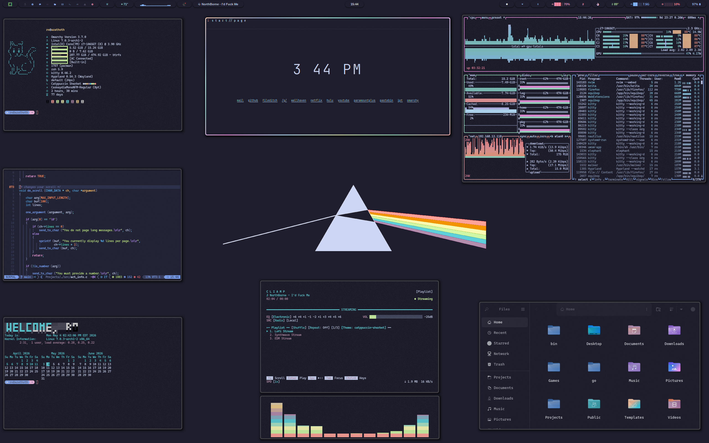

# Catppuccin Sherbet Theme

An Omarchy Theme for your Arch Linux / Hyprland setup based on Catppuccin with sherbet colors. The included waybar theme which is a modification of [HANCORE](https://github.com/HANCORE-linux)'s 'V2.1b' waybar theme. Waybar theme is found in the waybar-theme folder. 

Waybar themes can be easily managed by '[Wayflipper](https://github.com/OldJobobo/wayflipper)' by OldJobobo

# Installation

To install this theme, simply use the ``omarchy-theme-install``   

command: `` omarchy-theme-install https://github.com/signaldirective/catppuccin-sherbet ``  

## [Tip me on Ko-Fi!](https://ko-fi.com/signaldirective)   
  

**Theme by Signal Directive**
**Additional Credits:** HANCORE for Waybar theme.
